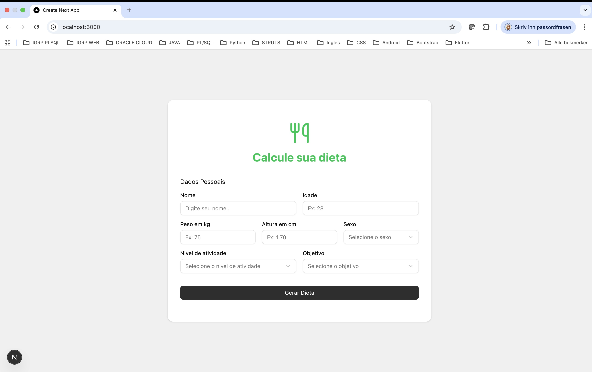
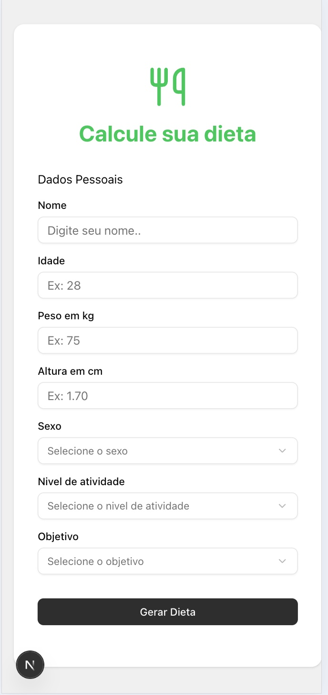
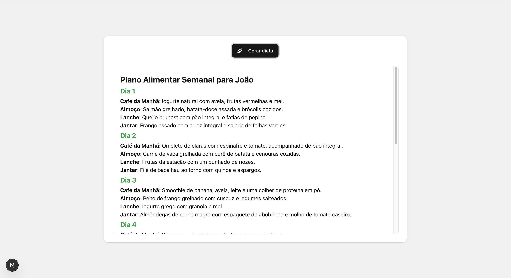

# Projeto Dieta 🍏

O Projeto Dieta é uma aplicação web que utiliza inteligência artificial para gerar planos de dieta personalizados e completos para 7 dias, baseados nas informações e objetivos do usuário.

Este repositório contém duas partes principais: o **Frontend (Web)** e o **Backend (API)**.

---

## 📸 Visualização do Projeto

| Formulário (Desktop e Mobile) | Geração da Dieta | Plano Semanal |
| :---: | :---: | :---: |
|  <br>  |  |  |

---

## ✨ Funcionalidades

- **Geração de Dieta com IA:** Cria um plano de dieta semanal personalizado.
- **Entrada de Dados do Usuário:** Coleta informações como peso, altura, nível de atividade física e objetivos.
- **Resultados Detalhados:** Fornece um plano de dieta completo para 7 dias.

---

## 🚀 Tecnologias Utilizadas

### Frontend (Web)
- **Framework:** Next.js 15 (com React 19) para renderização no servidor e interfaces reativas.
- **Linguagem:** TypeScript.
- **Estilização:** Tailwind CSS para um design rápido e responsivo (mobile-first).
- **Componentes:** shadcn/ui sobre Radix UI para componentes de UI acessíveis e reutilizáveis.
- **Ícones:** Lucide React para ícones leves e consistentes.
- **Formulários:** React Hook Form com Zod para validação de formulários robusta e eficiente.

### Backend (API)
- **Framework:** Fastify para uma API Node.js de alta performance.
- **Linguagem:** TypeScript.
- **IA:** OpenAI GPT para a geração inteligente dos planos de dieta.
- **Validação:** Zod para garantir a integridade e segurança dos dados de entrada e saída.
- **Comunicação:** CORS configurado para permitir a comunicação segura com o frontend.

---

## 🏁 Como Executar o Projeto

Siga os passos abaixo para executar o projeto em seu ambiente local.

1.  **Clone o repositório:**
    ```bash
    git clone <https://github.com/Leonildo-Gomes/diet-project-ai.git>
    cd dieta
    ```

Você precisará de dois terminais, um para o backend e outro para o frontend, abertos na pasta do projeto.

### Backend

1.  **Navegue até a pasta do backend:**
    ```bash
    cd backend
    ```

2.  **Instale as dependências:**
    ```bash
    npm install
    ```

3.  **Configure as variáveis de ambiente:**
    No arquivo `.env` adicione sua chave de API para o serviço de IA.
    ```
    API_KEY=SUA_CHAVE_DE_API_AQUI
    ```

4.  **Execute o servidor de desenvolvimento:**
    ```bash
    npm run dev
    ```
    O servidor backend estará em execução em `http://localhost:3001`.

### Frontend

1.  **Navegue até a pasta do frontend:**
    ```bash
    cd frontend
    ```

2.  **Instale as dependências:**
    ```bash
    npm install
    ```

3.  **Execute o servidor de desenvolvimento:**
    ```bash
    npm run dev
    ```

4.  **Abra no navegador:**
    Acesse [`http://localhost:3000`](http://localhost:3000) para ver a aplicação em execução.

---

## 📄 Licença

Este projeto está sob a licença MIT.
